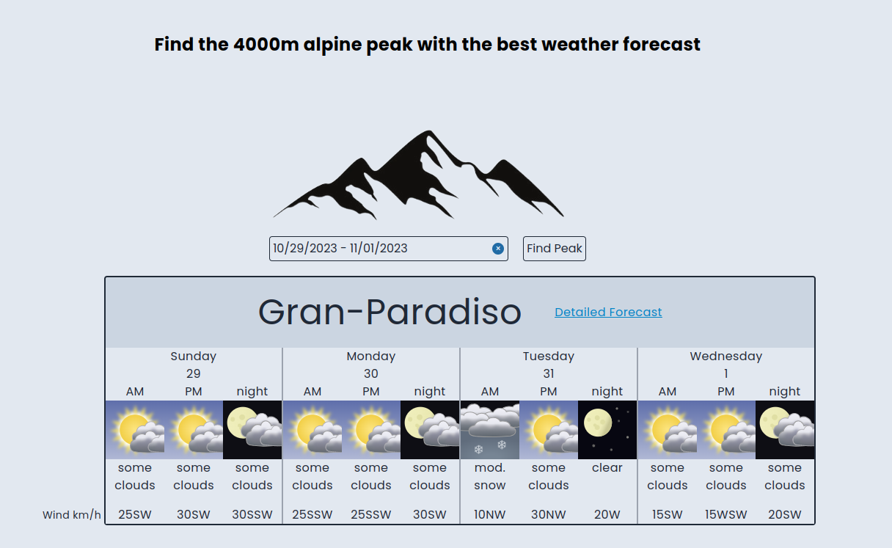
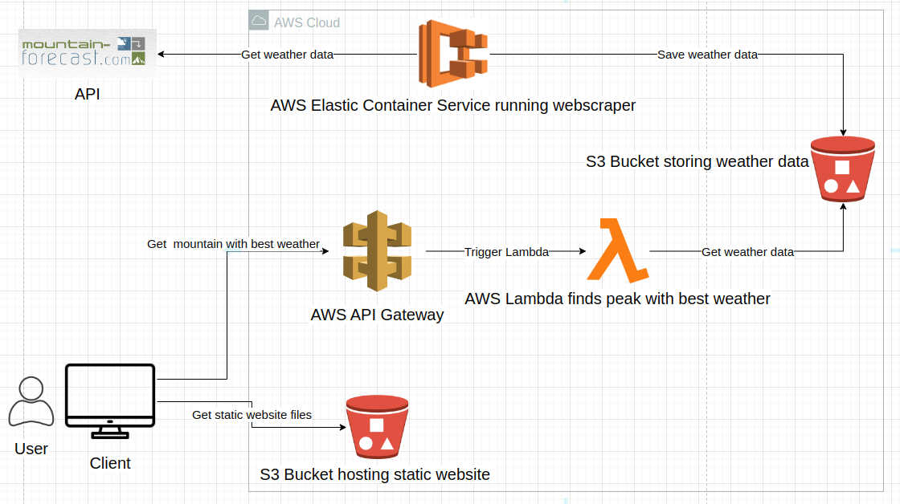

## Description
This repository contains all the files for the 82peaks web application. 
The web application can be accessed by clicking [here](http://peaks-bucket-frontend-mainly-wanted-swan.s3-website.eu-central-1.amazonaws.com/).
This web application allows users to find the 4000+ alpine peak with the best weather forecast in the coming week.

## Architecture

### Web scraper
A webscraper is built from a python image that runs on AWS ECS. 
This web scraper scrapes the mountain forecast API every 24 hours. 
The forecasted weather data is stored in an S3 bucket.
The files for the web scraper image can be found in the `web_scraper_image` folder.
The terraform files used to set up ECS and the S3 bucket can be found in the `terraform_files` folder.

### API
The API is built using AWS API Gateway with a Lambda function integration. 
The Lamba function uses the data that the web scraper stored in the S3 bucket 
to calculate the peak with the best weather and return this 
information to API Gateway which returns it to the client.
All files used to build the API can be found in the `terraform_files` folder.

### Frontend 
The fronted is built using Next.js. 
Next.js allows for the creation of fully static websites 
which in combination with static website hosting in S3 makes website hosting very simple and cost effective.
All files used for the Next.js static website can be found in the `fronted` folder.
All files used to configure the S3 bucket for static website hosting can be found in the `terraform_files` folder.

